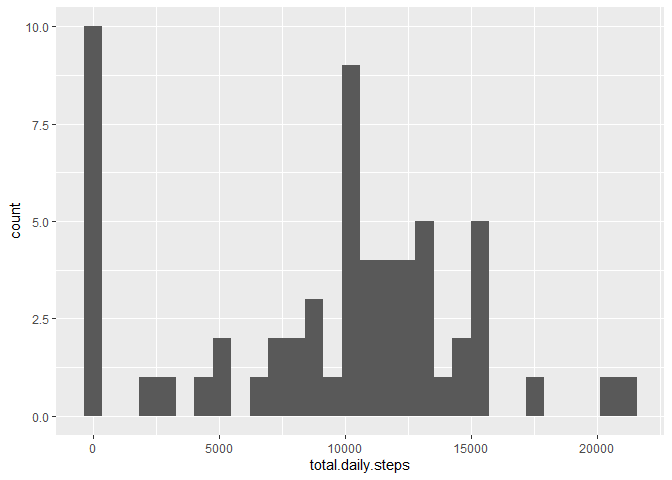
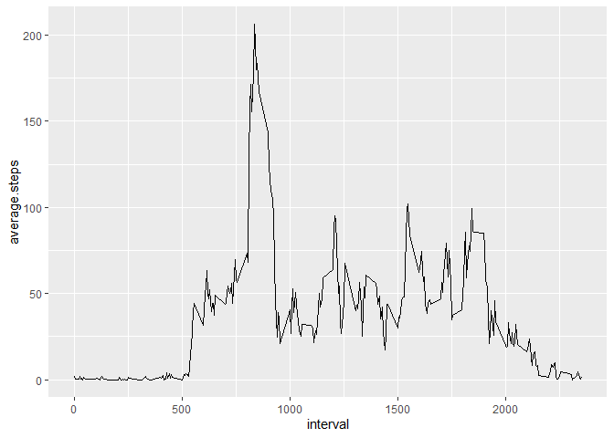
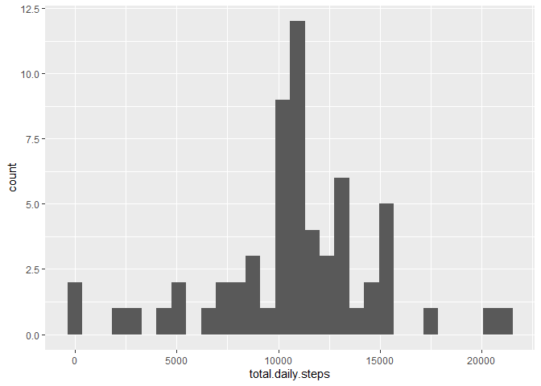
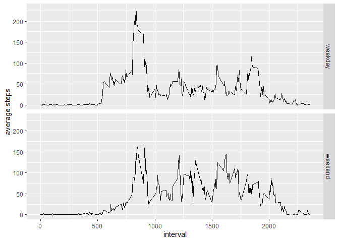

## Loading and preprocessing the data
Also loading all the libraries to be needed beforehand.  
read_csv from readr package can directly read from zip files.  
Further processing of data will be done as needed.

```r
library(readr)
```

```
## Warning: package 'readr' was built under R version 4.3.3
```

```r
library(dplyr)
```

```
## Warning: package 'dplyr' was built under R version 4.3.3
```

```
## 
## Attaching package: 'dplyr'
```

```
## The following objects are masked from 'package:stats':
## 
##     filter, lag
```

```
## The following objects are masked from 'package:base':
## 
##     intersect, setdiff, setequal, union
```

```r
library(ggplot2)
```

```
## Warning: package 'ggplot2' was built under R version 4.3.3
```

```r
activity <- read_csv("activity.zip")
```

```
## Rows: 17568 Columns: 3
```

```
## ── Column specification ────────────────────────────────────────────────────────
## Delimiter: ","
## dbl  (2): steps, interval
## date (1): date
## 
## ℹ Use `spec()` to retrieve the full column specification for this data.
## ℹ Specify the column types or set `show_col_types = FALSE` to quiet this message.
```

## What is mean total number of steps taken per day?  

### Calculating the total number of steps taken per day  

```r
q1 <- activity %>% 
  group_by(date) %>% 
  summarise(total.daily.steps = sum(steps, na.rm = TRUE))
```

### Making a histogram of the total number of steps taken each day

```r
ggplot(q1, aes(total.daily.steps)) + 
  geom_histogram()
```

```
## `stat_bin()` using `bins = 30`. Pick better value with `binwidth`.
```

<!-- -->

### Calculating and reporting the mean and median of the total number of steps taken per day

```r
q1mean <- mean(q1$total.daily.steps)
q1mean
```

```
## [1] 9354.23
```

```r
q1median <- median(q1$total.daily.steps)
q1median
```

```
## [1] 10395
```


## What is the average daily activity pattern?  

Calculating the average number of steps taken in each interval

```r
q2 <- activity %>% 
  group_by(interval) %>% 
  summarise(average.steps = mean(steps, na.rm = TRUE))
```

### Making a time series plot of the 5-minute interval (x-axis) and the average number of steps taken, averaged across all days (y-axis) 

```r
ggplot(q2, aes(interval, average.steps)) + 
  geom_line()
```

<!-- -->

### Which 5-minute interval, on average across all the days in the dataset, contains the maximum number of steps?

```r
q2$interval[which.max(q2$average.steps)]
```

```
## [1] 835
```

## Imputing missing values

### Calculating and reporting the total number of missing values in the dataset

```r
sum(is.na(activity))
```

```
## [1] 2304
```

### Creating a new dataset that is equal to the original dataset but with the missing data filled in.  
The mean for that 5-minute interval was used for filling in all of the missing values in the dataset.

```r
activity_imputed <- activity %>% 
  group_by(interval) %>% 
  mutate(average.steps = mean(steps, na.rm = TRUE)) %>% 
  ungroup() %>% 
  mutate(steps = coalesce(steps, average.steps))
```

### Making a histogram of the total number of steps taken each day
First, total number of steps taken every day was calculated using the imputed data.

```r
q3 <- activity_imputed %>% 
  group_by(date) %>% 
  summarise(total.daily.steps = sum(steps, na.rm = TRUE))

ggplot(q3, aes(total.daily.steps)) + 
  geom_histogram()
```

```
## `stat_bin()` using `bins = 30`. Pick better value with `binwidth`.
```

<!-- -->

### Calculating and reporting the mean and median total number of steps taken per day

```r
q3mean <- mean(q3$total.daily.steps)
q3mean
```

```
## [1] 10766.19
```

```r
q3median <- median(q3$total.daily.steps)
q3median
```

```
## [1] 10766.19
```

### These values differ from the estimates from the first part of the assignment

```r
q3mean - q1mean
```

```
## [1] 1411.959
```

```r
q3median - q1median
```

```
## [1] 371.1887
```

### Impact of imputing missing data on the estimates of the total daily number of steps
Imputing shifts the data righwards, i.e. increasing the mean and median.


## Are there differences in activity patterns between weekdays and weekends?

### Creating a new factor variable in the dataset with two levels – “weekday” and “weekend” indicating whether a given date is a weekday or weekend day
then, average number of steps in each interval is also calculated.  

```r
q4 <- activity_imputed %>%
  mutate(weekday = as.factor(case_when(
    .default = "weekday",
    weekdays(date) == "Saturday" ~ "weekend",
    weekdays(date) == "Sunday" ~ "weekend"
    )))  %>% 
  group_by(weekday, interval) %>% 
  summarise(average.steps = mean(steps, na.rm = TRUE))
```

```
## `summarise()` has grouped output by 'weekday'. You can override using the
## `.groups` argument.
```

### Making a panel plot containing a time series plot of the 5-minute interval (x-axis) and the average number of steps taken, averaged across all weekday days or weekend days (y-axis)  

```r
ggplot(q4, aes(interval, average.steps)) + 
  geom_line() + facet_grid(weekday~.)
```

<!-- -->
  
The number of steps were lower in weekends than weekdays in the 500 to 1000 range of interval. This might be caused by people waking up late in weekends.
