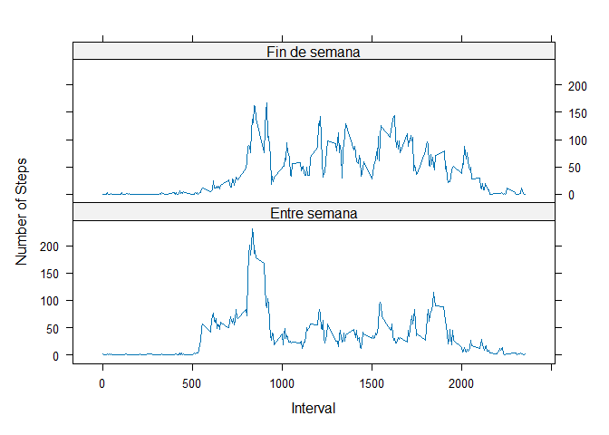

**Este documento contiene el trabajo completado para la tarea de pares \# 1 para la clase de Investigación Reproducible de Coursera.**

###Carga y preprocesamiento de datos

------------------------------------------------------------------------

Cargar los paquetes necesarios para este análisis:


A continuación, descargaré el conjunto de datos necesario para esta tarea. Descripción de estos datos del sitio web del curso:

\*Esta tarea utiliza los datos de un dispositivo de monitorización de la actividad personal. Este dispositivo recoge datos en intervalos de 5 minutos a lo largo del día. Los datos consisten en dos meses de datos de un individuo anónimo recogidos durante los meses de octubre y noviembre de 2012 e incluyen el número de pasos dados en intervalos de 5 minutos cada día.

Las variables incluidas en este conjunto de datos son:

1.  **Pasos**: Número de pasos dados en un intervalo de 5 minutos (los valores perdidos se codifican como NA ).
2.  **fecha**: Fecha en la que se realizó la medición en formato AAAA-MM-DD.
3.  **intervalo**: Identificador del intervalo de 5 minutos en el que se realizó la medición.

A continuación, voy a leer estos datos en un marco de datos e inspeccionar la estructura de los datos


```r
unzip("activity.zip", "activity.csv")
 
data_file <- "activity.csv"
  
dat <- read.csv(file = data_file, colClasses = c("integer", "Date", "integer"))

# Mostrar las primeras líneas del dataframe para verificar
head(dat)
```

```
##   steps       date interval
## 1    NA 2012-10-01        0
## 2    NA 2012-10-01        5
## 3    NA 2012-10-01       10
## 4    NA 2012-10-01       15
## 5    NA 2012-10-01       20
## 6    NA 2012-10-01       25
```

```r
# Mostrar un resumen de los datos para inspección inicial
summary(dat)
```

```
##      steps             date               interval     
##  Min.   :  0.00   Min.   :2012-10-01   Min.   :   0.0  
##  1st Qu.:  0.00   1st Qu.:2012-10-16   1st Qu.: 588.8  
##  Median :  0.00   Median :2012-10-31   Median :1177.5  
##  Mean   : 37.38   Mean   :2012-10-31   Mean   :1177.5  
##  3rd Qu.: 12.00   3rd Qu.:2012-11-15   3rd Qu.:1766.2  
##  Max.   :806.00   Max.   :2012-11-30   Max.   :2355.0  
##  NA's   :2304
```

###Histograma, Media y Mediana

------------------------------------------------------------------------

A continuación, haré un histograma del número total de pasos dados cada día, pero antes resumiré los datos por días:


```r
library(data.table)
```

```
## 
## Attaching package: 'data.table'
```

```
## The following objects are masked from 'package:dplyr':
## 
##     between, first, last
```

```r
dat_tbl = data.table(dat)
dat_tbl_summary = dat_tbl[, list(total_steps = sum(steps, na.rm = T)), 
                          by = date]
```

**Realice el histograma e informe sobre la media y la mediana:**

El histograma que se muestra a continuación aborda los siguientes puntos:

1.  Haga un histograma del número total de pasos dados cada día
2.  Calcular e informar de la media y la mediana del número total de pasos dados al día.

**Nota: La media y la mediana se indican en la leyenda del histograma.**


```r
gen_hist = function(x, title){
        hist(x, 
             breaks = 20,
             main = title,
             xlab = 'Total Number of Steps', col = 'grey',
            
             cex.main = .9)
         
        mean_value = round(mean(x), 1)
        median_value = round(median(x), 1)
         
        abline(v=mean_value, lwd = 3, col = 'blue')
        abline(v=median_value, lwd = 3, col = 'red')
         
        legend('topright', lty = 1, lwd = 3, col = c("blue", "red"),
               cex = .8, 
               legend = c(paste('Mean: ', mean_value),
               paste('Median: ', median_value))
               )
}

gen_hist(dat_tbl_summary$total_steps, 'Number of Steps Taken Per Day')
```

<!-- -->

###Patrón de actividad diaria

------------------------------------------------------------------------

**A continuación, intentaré visualizar el patrón de actividad diaria**

El siguiente gráfico aborda los siguientes puntos:

1.  Haga un gráfico de series temporales (es decir, tipo = "l") del intervalo de 5 minutos (eje x) y el número medio de pasos dados, promediado en todos los días (eje y)
2.  ¿Qué intervalo de 5 minutos, como media de todos los días del conjunto de datos, contiene el máximo número de pasos?


```r
dat_tbl_summary_intv = dat_tbl[, list(avg_steps = mean(steps, na.rm = T)), 
                          by = interval]

with(dat_tbl_summary_intv, {
        plot(interval, avg_steps, type = 'l',
             main = 'Average Steps by Time Interval',
             xlab = '5 Minute Time Interval',
             ylab = 'Average Number of Steps')
        })

max_steps = dat_tbl_summary_intv[which.max(avg_steps), ]


max_lab = paste('Maximum Of ', round(max_steps$avg_steps, 1), ' Steps \n On ', max_steps$interval, 'th Time Interval', sep = '')


points(max_steps$interval,  max_steps$avg_steps, col = 'red', lwd = 3, pch = 19)


legend("topright",
       legend = max_lab,
       text.col = 'red',
       bty = 'n'
       )
```

<!-- -->

------------------------------------------------------------------------

###Valores perdidos

1.  Calcular e informar del número de valores perdidos


```r
sum(is.na(dat$steps))
```

```
## [1] 2304
```

1.  Diseñe una estrategia para completar todos los valores que faltan en el conjunto de datos. No es necesario que la estrategia sea sofisticada. Por ejemplo, puede utilizar la media/mediana de ese día, o la media de ese intervalo de 5 minutos, etc.

2.  Cree un nuevo conjunto de datos igual al original, pero con los datos que faltan.


```r
#En primer lugar, uniré el marco de datos que creé anteriormente y que resume el número medio de pasos por intervalo al conjunto de datos original.
setkey(dat_tbl, interval)
setkey(dat_tbl_summary_intv, interval)

NA_replace = function(x,y){
        if(is.na(x)){
                
                return(y)
        }
        return(x)
}


dat_tbl_miss = dat_tbl[dat_tbl_summary_intv]
dat_tbl_miss$new_steps = mapply(NA_replace,dat_tbl_miss$steps, dat_tbl_miss$avg_steps)


dat_tbl_summary_miss = dat_tbl_miss[, list(new_steps = sum(new_steps, na.rm = T)), 
                          by = date]

head(dat_tbl_summary_miss)
```

```
##          date new_steps
##        <Date>     <num>
## 1: 2012-10-01  10766.19
## 2: 2012-10-02    126.00
## 3: 2012-10-03  11352.00
## 4: 2012-10-04  12116.00
## 5: 2012-10-05  13294.00
## 6: 2012-10-06  15420.00
```

4.  Haz un histograma del número total de pasos dados cada día y calcula e informa de la media y la mediana del número total de pasos dados al día. ¿Difieren estos valores de las estimaciones de la primera parte de la tarea? ¿Qué impacto tiene la imputación de los datos que faltan en las estimaciones del número total de pasos diarios?

**Nota: La media y la mediana se indican en la leyenda del histograma.**


```r
gen_hist(dat_tbl_summary$total_steps, 'Missing Values Removed')
```

<!-- -->

```r
gen_hist(dat_tbl_summary_miss$new_steps, 'Missing Values Replaced With \n Mean For Interval')
```

<!-- -->

**Respuesta a la pregunta:** La media y la mediana son ahora casi iguales después de sustituir los valores que faltan por el valor medio del intervalo correspondiente. Tiene sentido que el valor de la mediana se acerque ahora a la media. Así que el valor de la mediana aumentó después de este método de sustitución de valores perdidos.

###¿Existen diferencias en los patrones de actividad entre los días laborables y los fines de semana?

------------------------------------------------------------------------

1.  

    1.  Cree una nueva variable factorial en el conjunto de datos con dos niveles: "día laborable" y "fin de semana" que indiquen si una fecha determinada es un día laborable o un fin de semana.


```r
#Make Function To Return Either "Weekday" or "Weekend"
weekpart = function(x){
        if(x %in% c('sábado', 'domingo')){
                return('Fin de semana')
        }
        
        return('Entre semana')
}
 
dat_tbl_miss$dayname = weekdays(as.Date(dat_tbl_miss$date))
 
dat_tbl_miss$daytype = as.factor(apply(as.matrix(dat_tbl_miss$dayname), 1, weekpart))
 
dat_tbl_summary_miss = dat_tbl_miss[, list(avg_steps = mean(new_steps, na.rm = T)), 
                          by = list(interval, daytype)]
 
str(dat_tbl_summary_miss)
```

```
## Classes 'data.table' and 'data.frame':	576 obs. of  3 variables:
##  $ interval : int  0 0 5 5 10 10 15 15 20 20 ...
##  $ daytype  : Factor w/ 2 levels "Entre semana",..: 1 2 1 2 1 2 1 2 1 2 ...
##  $ avg_steps: num  2.2512 0.2146 0.4453 0.0425 0.1732 ...
##  - attr(*, ".internal.selfref")=<externalptr>
```

A continuación se muestra el gráfico de paneles:


```r
library(lattice)
xyplot(avg_steps~interval | daytype, data = dat_tbl_summary_miss, type = 'l', xlab = 'Interval', ylab = 'Number of Steps', layout = c(1,2))
```

<!-- -->
